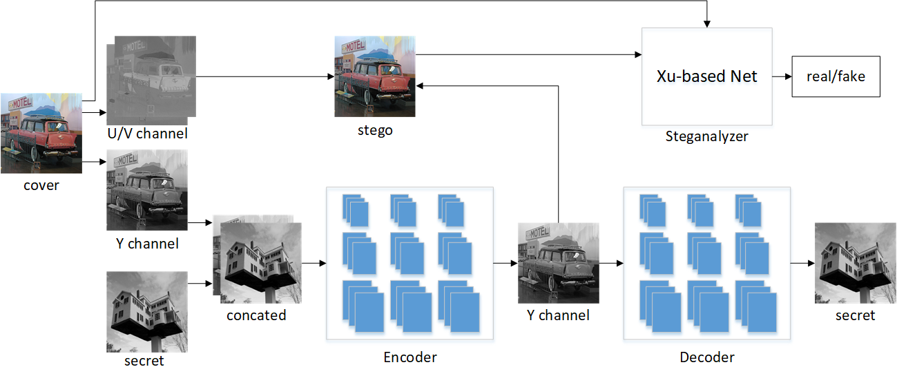
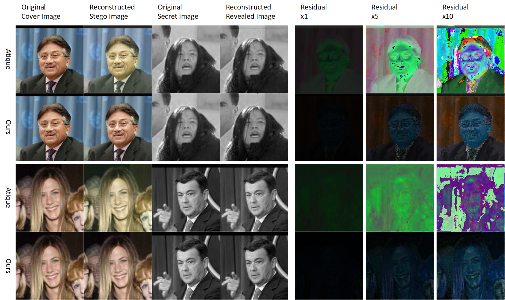
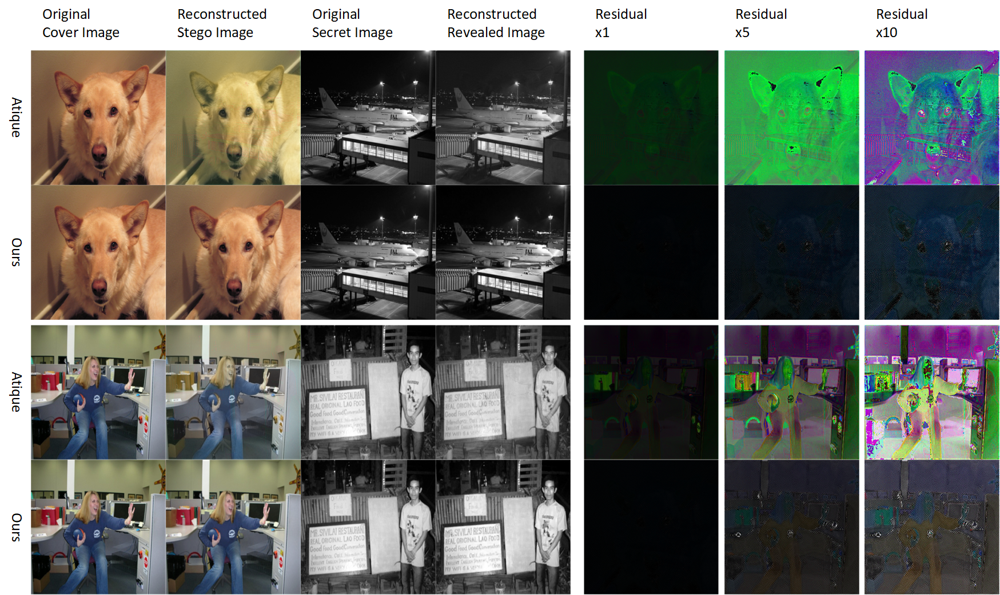
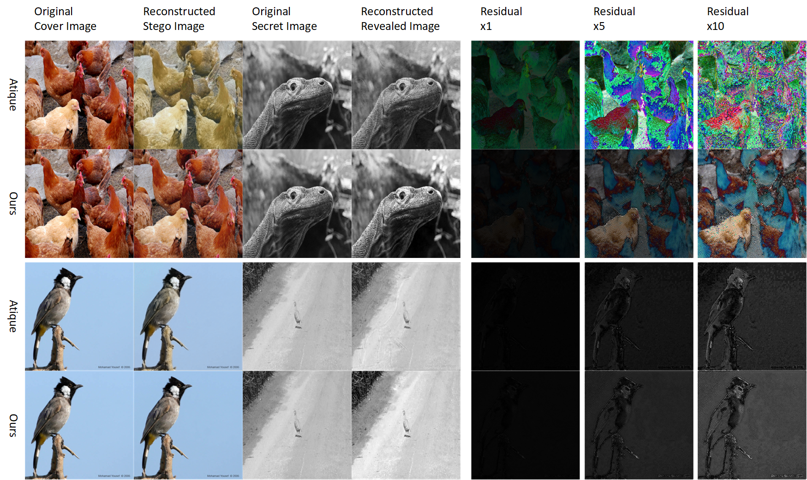

# Invisible Steganography via Generative Adversarial Network

Our basic model conceals a gray secret image into a color cover image. To strengthen the invisibility, we transform the color image from RGB ro YUV, then hiding the secret image into the Y channel. After hidding, we transform the stego image back to RGB, so the secret image is spreaded into three channels of RGB. This measure can save all color information into the stego image. There are some examples below. 

I will add the details soon.

# References

 - [Hiding Images in Plain Sight: Deep Steganography](https://papers.nips.cc/paper/6802-hiding-images-in-plain-sight-deep-steganography)

 - [End-to-end Trained CNN Encode-Decoder Networks for Image Steganography](https://arxiv.org/abs/1711.07201)